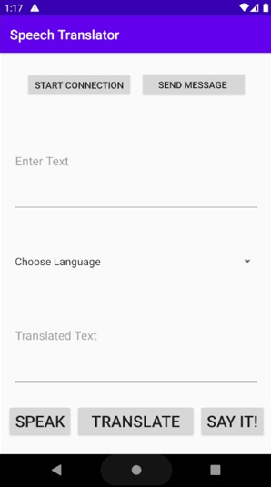

<h1>Translator App </h1>

<h2>Aim:</h2>

 To create an app, which can take input as user’s voice and translate it into the desired language, and finally provide translated voice as output. 

 
<h2>Objectives:</h2>  
 
* Take input voice of user
* Send input for language detection
* Option menu for language selection
* Translate the input speech into the selected language
* Give the output voice of the translated input voice
 
 

<h2>Project Overview:</h2>
 

 The android application which will translate text of one language into another. Using Android Studio and Java the android application was built,
Firebase API called one-device translation used to translate text from one language to other desired language of users choice. Three buttons are present
at the bottom, where the 'SPEAK' button will take voice as input, the 'TRANSLATE' button is used to translate text into selected language from the given list.
On clicking the 'SAY IT!' button the translated text will be given in voice format. Now coming towards the top section, there exists two buttons to start connection
with the python server. And other button will send data to the server. The server is made with python, concept of socket programming was implemented to eastablish 
connection between client and server. Natural Language Processing (NLP) was used to create language detecting model, the same model was extracted in the pckl format
and used on the server to detect the language of text collected from the application. After detecting the language respective output was given back to the application
in the form of response. This application can even work in offline mode, and translate text of 5 different languages.

 

 Five languages: 

 
* English
* German
* French
* Marathi
* Hindi
 
 

<h2>Technology Stack:</h2>
Following is the technology stack for:
 
* App - Java, Android Studio
* Firebase - One-device translation API
* Server - Python + Jupyter

<h2>Navigation:</h2>
Following are the navigations for:

* language_detection/ - contains data of various languages and jupyter notebook with language detection python code 
* socket_programmin/ - contains the pckl file of language detecting model and jupyter notebook for connection between server and client
* translator_app/ - contains the android files
* video/ - contains the video of working of the whole project
* media/ - conatins banner image and results
 

<h3>Results:</h3>

<h3>GitHub Link: </h3> <a href="https://github.com/more-harsh/Translator-App"> https://github.com/more-harsh/Translator-App </a>

 
 
